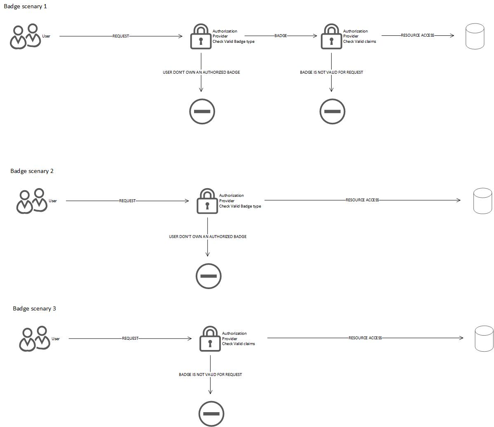

# Dew BadgeMiddleware
A middleware for authorization in a website.

It works with dependency injecton and factory patterns so you can also customize it as you want.

By default you will find two base classes, cookie authentication and jwt authentication.

# Objects

Here we have the list of objects for the middleware.

- __DewBadgeAttribute__: an attribute class for badge request
- __DewBadgeOptions__: a base class for badge options. You can extend with your custom options (see __DewBadgeOptionsJWT__ or __DewBadgeOptionCookies__)
- __DewBadge__: the main badge class (implements IDewBadge) and base class for your implementations
- __IDewBadge__: Badge interface
- __IDewBadgeSigner__: Signer interface - you can use the default implementatinos (DewBadgeSignerCookies or DewBadgeSignerJWT) or use one of yours

# Badge concept

How works the badge?

The idea is that every user has a badge, and the badge can be used in various ways.
- The first and most simple is to assign a type to the badge, and, when the user will try to access to a resource, you will ask him about his badge and check the type (scenario 2).
- The second is simple like the first, but when you create the badge, you can set in it a collection of claims. When the user will try to access to a resource, you will ask him about his badge and check the claims (scenario 3).
- The most complex scenario is about the check of the Badge type and also the check of the claims. Just imagine a scenario where you can have two users with the same badge type but with different authorizations. You can assign to each of them a different collection of claims, so you can manage both at the same security level.



# The middleware

Some example about the use of the middleware

## How it works


### Startup class

A simplest use of the middleware in the startup class is defined here:

```c#
app.UseBadgeMiddleware<DewBadgeSignerCookies>(new DewBadgeOptionsCookies()
                                             {
                                                 CookieName = "mycookielogin",
                                                 CookieExpiring = DateTime.Now.AddDays(5),
                                                 RedirectNotAuthorized = "/errors/noauth"
                                             });
```

How you can see, when you call __UseBadgeMiddleware__ you need to pass a type that implements __IDewBadgeSigner__ interface. Via factory patter the middleware will initialize it and use it.

__NOTE:__ The method has a costraint that will check if the IDewBadgeSigner has a public and parameterless constructor

__NOTE:__ If no option will be passed, the middleware will create the default options

### Controllers actions

Here you can see how use the badge in the controllers.

```c#
[DewBadge(claims: "m1,v1")]
public IActionResult CheckClaims()
{
    ViewData["Message"] = "If you read this message, you have the m1 or v1 claim.";
    return View();
}
[DewBadge(type: "card")]
public IActionResult CheckType()
{
    ViewData["Message"] = "If you read this message, you have the card badge type.";
    return View();
}
[DewBadge(claims: "m1,v1", type: "card")]
public IActionResult CheckBoth()
{
    ViewData["Message"] = "If you read this message, you have the card badge type with m1 or v1 claims.";
    return View();
}
```

__NOTE:__ If the action miss the claims or types, response will be redirect to RedirectNotAuthorized url (options)

__NOTE:__ If the action miss the signature or the options, response will be redirect to RedirectOnError (options)

### Default options

- RedirectOnError: the url to redirect when the action miss signature
- RedirectNotAuthorized: the url to redirect when the action miss claims or type
- Secret: The secret key to encript the signature

#### Additional default options

##### DewBadgeOptionsCookies

- CookieName: The cookie name (default "authsign")
- CookieExpiring: The cookie expiring time (default 60 minutes)

##### DewBadgeOptionsJWT

- HeaderName: The header field that contains the sign (default "Authorization")
- Beader: String that contains "bearer "

### Badge class (implements IDewBadge)

The default base DewBadge class. You can implement your own version.

This version has:

- UserId: property
- Created: property
- Expired: property
- Updated: property
- Claims: property 

__NOTE:__ If you want to implement your own Badge class, you __NEED__ to extend DewBadge class, you can't only implement IDewBadge, because the middleware will not work.

### IDewBadgeSignature

This interface is essential if you want customize the way you get/set the signature.

We have 3 methods:

- GetSign: Return the sign
- SignIn: Set the sign
- SignOut: Unset the sign

If you want some example you can check the default classes in DewBadge for the signatures:

- __DewBadgeSignerJWT__ : IDewBadgeSignature implementation for JWT
- __DewBadgeSignerCookies__: IDewBadgeSignatore implementation for cookies 

How you seen in the middleware use, you pass the signature class to middleware (and the factory pattern will initialize it).


```c#
app.UseBadgeMiddleware<DewBadgeSignerCookies>(new DewBadgeOptionsCookies()
                                             {
                                                 CookieName = "mycookielogin",
                                                 CookieExpiring = DateTime.Now.AddDays(5),
                                                 RedirectNotAuthorized = "/errors/noauth"
                                             });
```

How you can see, when you call __UseBadgeMiddleware__ you need to pass a type thats implements __IDewBadgeSigner__ interface. Via factory patter the middleware will initialize it and use it.

__NOTE:__ The method has a costraint that will check if the IDewBadgeSigner has a public and parameterless constructor.

__NOTE:__ You will use only SignIn and SignOut, GetSign is used by middleware (however if you want you can use it wherever you want)

However lets see an example of SignIn:

```c#
[HttpPost]
public IActionResult Login(string name, string pwd)
{
    if (name == "elcarro" && pwd == "carriage")
    {
        var badge = new DewBadge("card") { IdUser = 111, Claims = new BadgeClaims() { "m1", "m2", "v4" }, };
        HttpContext.DewBadgeSignIn<DewBadgeSignerCookies>(badge);
    }
    return Ok();
}
```

This is a very quite example. Obviously in a real scenario there are a database connection, more checks, etc.

However check the code:

If name and password are ok, the we create a badge of type "card" and assign an IdUser and various claims.

After that we pass it to __DewBadgeSignIn\<DewBadgeSignerCookies\>__. This method will create a cookie that respect or cookieoptions (see above) and this will be used by middleware to check/get the signature.

However you should note the Injection of DewBadgeSignerCookies into the method. Via factory pattern the method will create an instance of your implementation of IDewBadgeSignature that will execute the SignIn method.

Same thing for SignOut.

__NOTE:__ In the middleware (in startup class) and when you call SignIn/Out methods, you need to pass the same IDewBadgeSignature implementation.

## Note 
## NuGet
You can find it on nuget with the name [DewBadgeMiddleware](https://www.nuget.org/packages/DewBadgeMiddleware)
## About
[Andrea Vincenzo Abbondanza](http://www.andrewdev.eu)

## Donate
[Help me to grow up, if you want](https://payPal.me/andreabbondanza)
